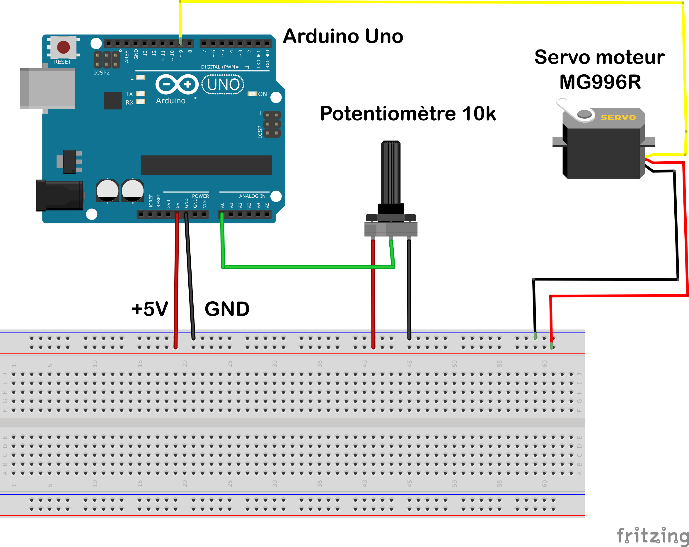
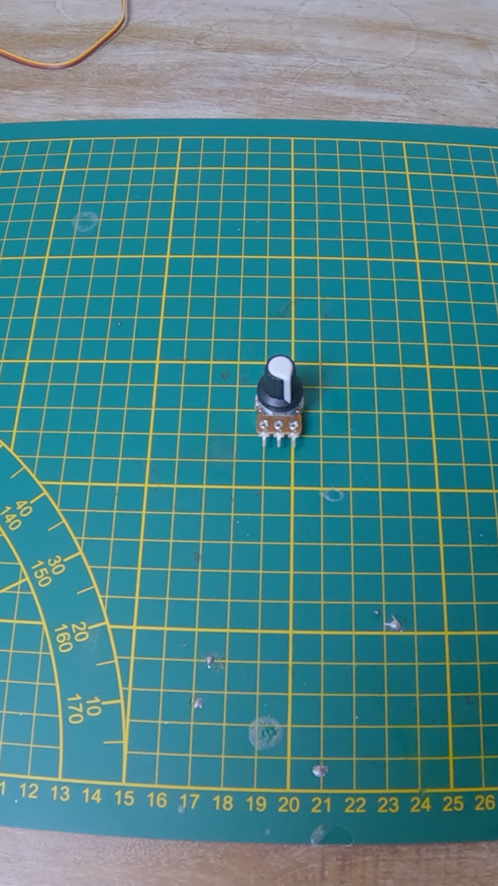
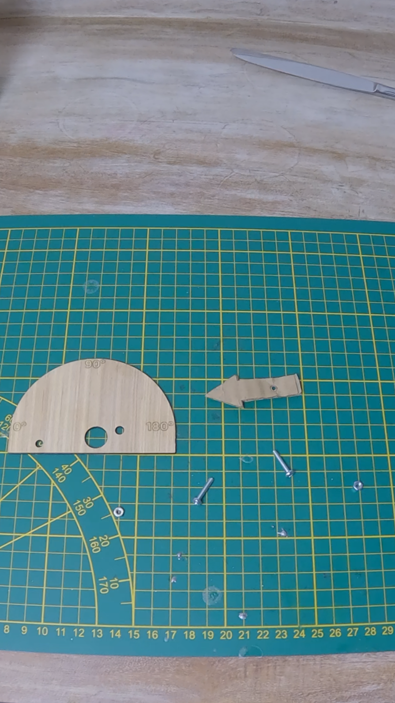
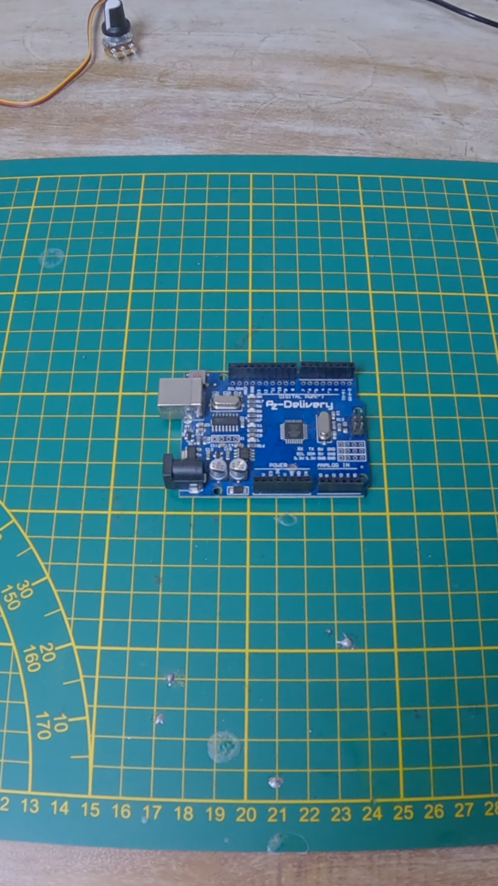
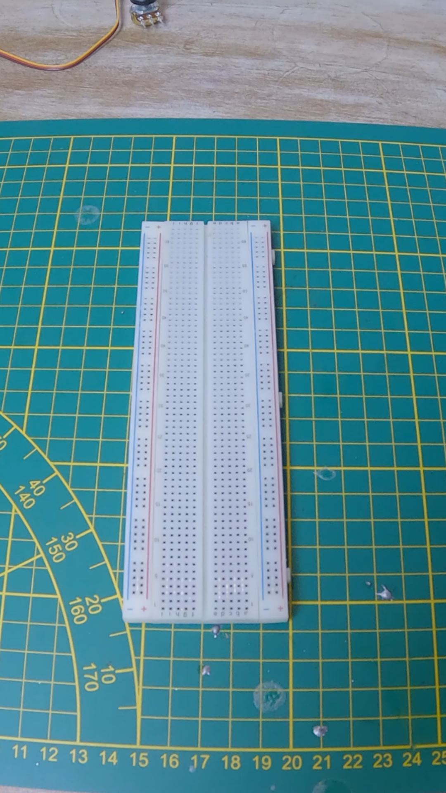
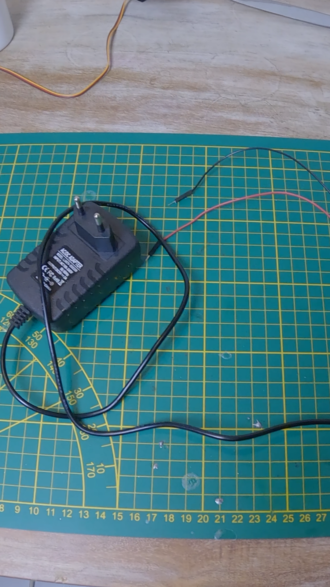
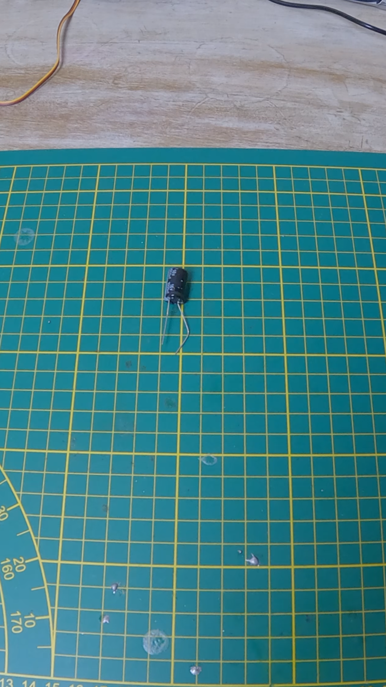
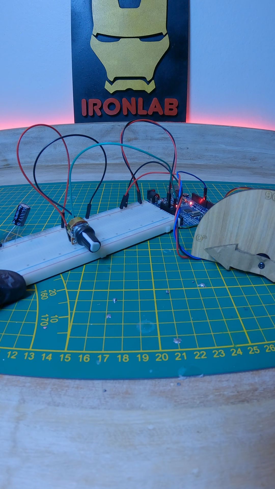

# Electr03-Arduino-Servo-Potentiometre

Ce projet Arduino te permet de contrôler un servomoteur (MG996R) en temps réel avec un potentiomètre 10kΩ. Tourner le potentiomètre fera pivoter le servomoteur selon l’angle correspondant.

---

## 🛠 Matériel nécessaire

- Arduino Uno
- Alimentation externe 5V (2-3A)
- Servomoteur MG996R
- Potentiomètre 10kΩ
- Breadboard
- Câbles Male (8 pour le montage)
- (Optionnel) Condensateur 1000 µF (pour stabiliser l’alimentation du servo)
- (Optionnel) Compas découpé au laser en carton ou en bois.
- (Optionnel) Flèche découpé au laser en carton ou en bois.
- (Optionnel) Vis diamètre 3mm longeur 15mm x2
- (Optionnel) Ecrou diamètre 3mm x2

---

## 🔌 Schéma de câblage

| Composant         | Arduino         |
|-------------------|-----------------|
| Potentiomètre OUT | A0              |
| Potentiomètre VCC | 5V              |
| Potentiomètre GND | GND             |
| Signal Servo      | D9              |
| VCC Servo         | 5V (externe)    |
| GND Servo         | GND commun      |




> ⚠️ Le MG996R peut consommer jusqu’à 2.5 A : ne pas l’alimenter directement depuis l’Arduino. Utilise une alimentation externe 5V bien régulée, et connecte sa masse à celle de l’Arduino.

---

## 🧠 Fonctionnement

- Le potentiomètre agit comme un diviseur de tension. La lecture analogique (0–1023) est convertie en un angle (0–180°).
- Le servo reçoit cet angle et ajuste sa position en conséquence.
- Un condensateur en parallèle sur l’alimentation du servo permet d’éviter les chutes de tension lors des pics de courant.

---

## 💾 Code Arduino

```cpp
#include <Servo.h>

Servo myServo;  // Création de l'objet servo

const int potPin = 0;    // Broche du potentiomètre
int potValue = 0;         // Valeur analogique lue
int angle = 0;            // Position convertie

void setup() {
  myServo.attach(9);      // Branchement du servo sur la broche D9
}

void loop() {
  potValue = analogRead(potPin);            // Lecture de la valeur du potentiomètre
  angle = map(potValue, 0, 1023, 0, 180);   // Conversion en angle pour le servo
  myServo.write(angle);                     // Déplacement du servo à l'angle donné
  delay(15);                                // Pause pour laisser le temps au servo de bouger
}
``` 
---

## 📷 Illustrations et assemblage

Potentiomètre 10kΩ


> Le pin de gauche +5v pin du milieu = donnée et pin de droite GND. 

Servo moteur MG996R


> Il est important d'utiliser une alimentation externe de 5V entre 1-3A.

Compas, vis et écrou


> Le compas a été découpé dans du contreplaqué de 3 mm à l'aide d'une découpeuse laser.  
> Si vous n'avez pas accès à une découpeuse laser, vous pouvez le réaliser en carton en imprimant d'abord le modèle sur du papier.  
> Le modèle se trouve dans le dossier **Schéma > compas.svg**.  
> Pour la flèche, j'ai utilisé du carton découpé au laser, car le contreplaqué de 3 mm est trop épais pour fixer correctement la vis de l'attache du servomoteur.  
> Vous pouvez également la faire en carton, en imprimant d'abord le gabarit sur papier.  
> Les vis et écrous utilisés sont deux vis de diamètre 3 mm et de longueur 15 mm.  
> Les écrous sont également au pas de 3 mm, correspondant aux vis.


Arduino Uno


Breadboard


Alimentation 5V 3A


> Dans ce projet, j’utilise une alimentation externe 5V 3A que j’ai modifiée dans une vidéo précédente.  
> Elle est connectée à la breadboard via les lignes +5V et GND, ce qui permet d’alimenter l’ensemble des composants du montage, y compris l’Arduino Uno.


Condensateur 1000 µF


> Le condensateur est optionnel mais si vous en avez à porté de main vous pouvez le branché directement sur la breadboard sur le +5v et GND comme sur le montage final.

Montage final


---

## 📌 Astuce

💡 Ajoute un condensateur de 1000 µF entre le +5V et GND de l’alimentation du servo pour éviter les variations de tension qui peuvent provoquer des mouvements imprévus ou des resets d’Arduino.

---

## ✍️ Nos projets

IronLab — Passionné d'électronique, robotique & projets DIY  

[YouTube](https://youtube.com/@ironlab_974) | [TikTok](https://www.tiktok.com/@ironlab_974) | [Instagram](https://www.instagram.com/ironlab_974)

AquaLab — La téchnologie au service du monde marin & chasse au trésor.

[YouTube](https://youtube.com/@aqualab_974) | [TikTok](https://www.tiktok.com/@aqualab_974) | [Instagram](https://www.instagram.com/aqualab_974)

Corail Création — Notre boutique

[TikTok](https://www.tiktok.com/@corail.creation) | [Instagram](https://www.instagram.com/corail.creation) | [Site marchand](https://www.corail-creation.re)

---

## 🔗 Ressources utiles

- [Documentation Servo Arduino](https://www.arduino.cc/en/reference/servo)
- [Datasheet MG996R](https://www.electronicoscaldas.com/datasheet/MG996R_Tower-Pro.pdf)

---

## 📄 Licence

Ce projet est open-source, sous licence MIT.  
N'hésitez pas à le modifier, le partager ou y contribuer.